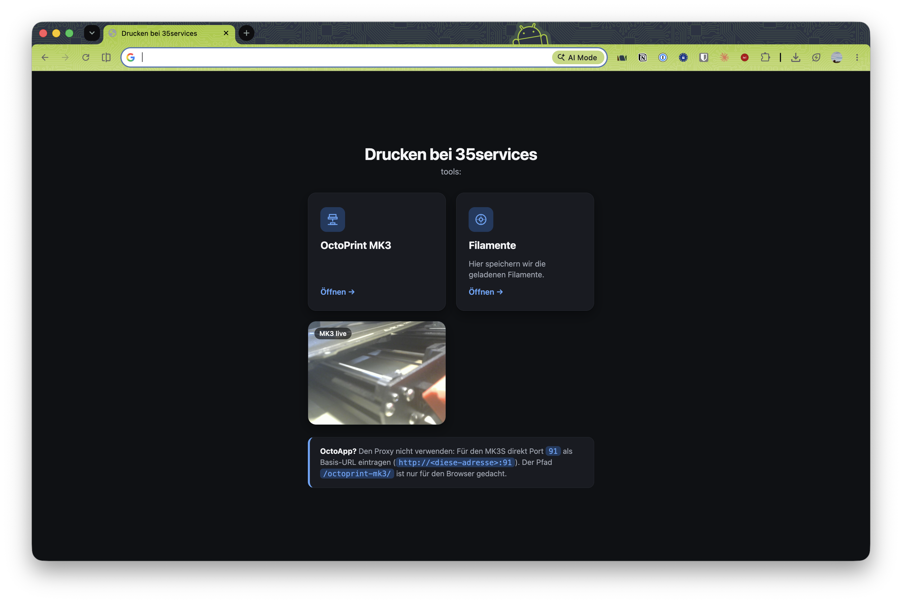

# Drucken bei 35services

We have a raspberry pi and run a bunch of services

## Routing

| Where | What |
|---|---|
| `:80` (HTTP, LAN) | landing page, `/octoprint-mk3/` (-> `:91`), `/octoprint-mk4/` (-> `:92`), `/filaments/` (-> `:81`). Requests for the Tailscale name are redirected to HTTPS |
| `https://<TS_DOMAIN>/` | same routes as above, over HTTPS |
| `https://<TS_DOMAIN>/vaultwarden/` | Vaultwarden password manager (-> `127.0.0.1:8080`, HTTPS only, see the `bitwarden` project) |

## HTTPS via Tailscale

The proxy gets a real Let's Encrypt certificate for the machine's `*.ts.net` name straight from the local `tailscaled`, no ACME/DNS setup and no CA to install on devices. HTTPS is therefore reachable from devices on the tailnet.

Requirements:

- "HTTPS Certificates" enabled in the Tailscale admin console (DNS page).
- `.env` with `TS_DOMAIN=<host>.<tailnet>.ts.net` (copy `.env.example`; `.env` is not committed).
- The tailscaled socket is mounted into the container (see `docker-compose.yml`).

Apply changes with `docker compose up -d` (a Caddyfile-only change can use `docker exec proxy caddy reload --config /etc/caddy/Caddyfile`). The first HTTPS request after a restart can be slow while the certificate is fetched.

Note: the services' own ports (`:91`, `:92`, `:81`, Portainer `:9443`) still answer directly over plain HTTP on the network. HTTPS through the proxy does not close them.
